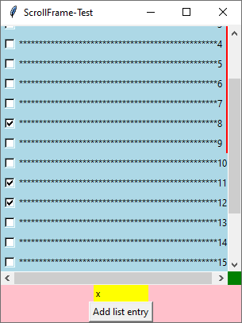
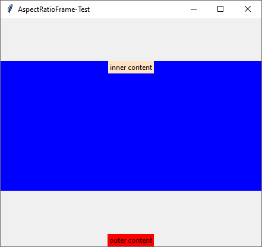

# Extended Frames
A set of extended frames based on tkinter.Frame. These allow to nest frames using the "with" statement,
to make them scrollable and to enforce an aspect ratio. 

## Install
### Create a conda environment
```bash
conda init bash # => Open new terminal
conda create --name extended_frames python=3.8
conda install --name extended_frames tk
```

### Activate the conda environment and start the program
```bash
cd extended_frames/
conda activate extended_frames
./main.py -t NestedFrame -t ScrollFrame -t AspectRatioFrame
```

## Here are some screenshots on what is possible
### ScrollFrame


### AspectRatioFrame



## How to use the program
Start the program with the desired test(s) using the -t command line option and play around resizing the window,
scroll, etc. and see how it behaves. Also feel free to change the code and see how the behaviour changes.
